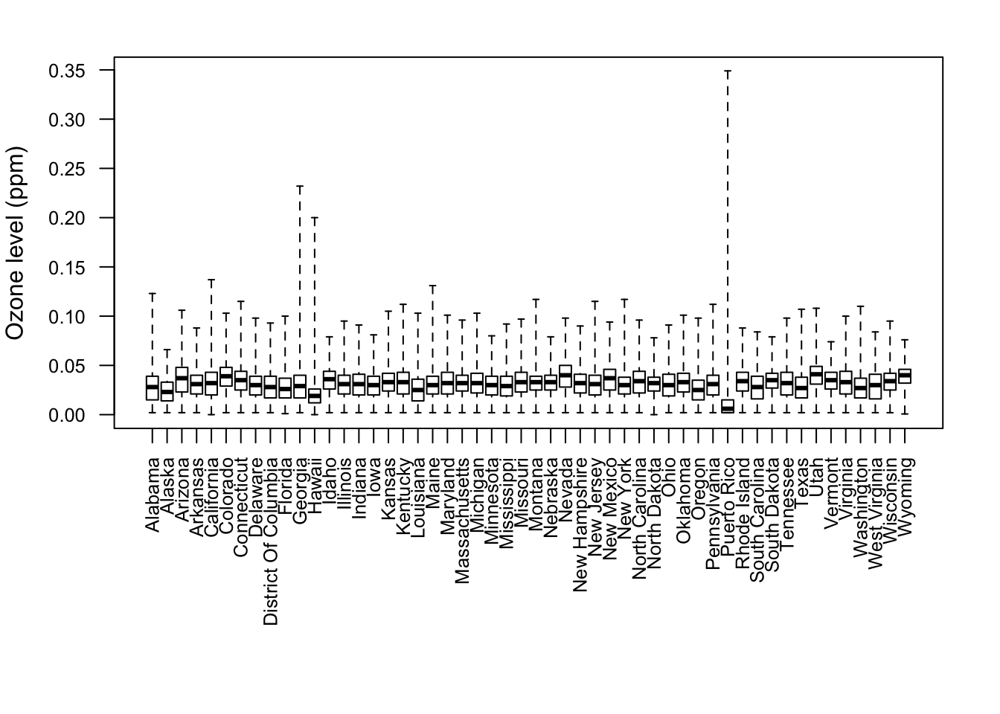
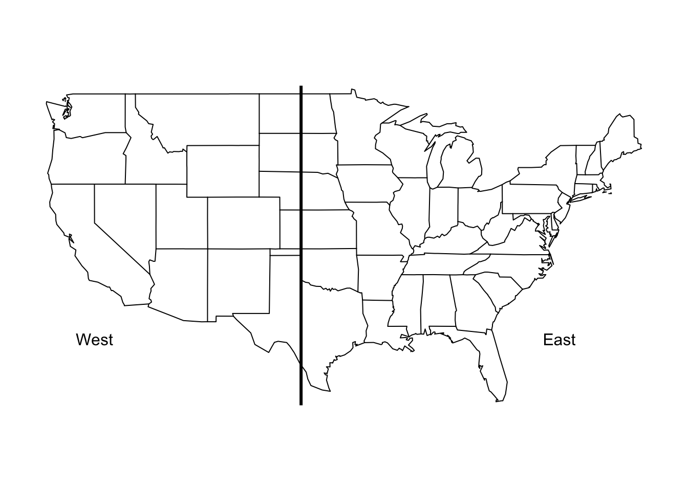
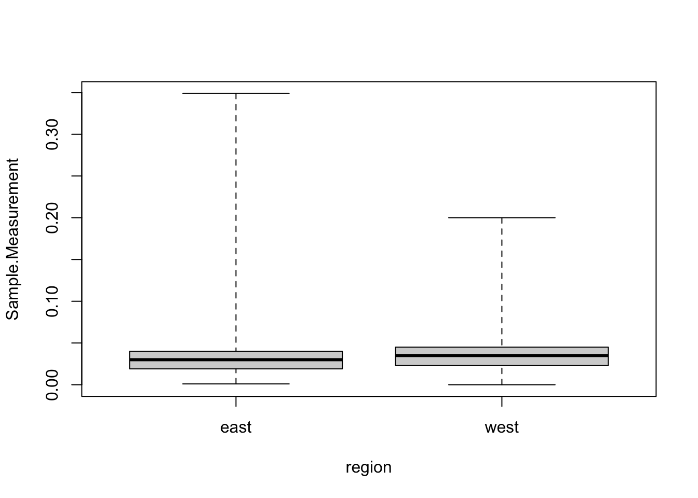

---
output:
  html_document:
    keep_md: yes
---
# Exploratory Data Analysis

Exploratory data analysis is the process of exploring your data, and it typically includes examining the structure and components of your dataset, the distributions of individual variables, and the relationships between two or more variables.  The most heavily relied upon tool for exploratory data analysis is visualizing data using a graphical representation of the data.  Data visualization is arguably the most important tool for exploratory data analysis because the information conveyed by graphical display can be very quickly absorbed and because it is generally easy to recognize patterns in a graphical display. 

There are several goals of exploratory data analysis, which are:

1. To determine if there are any problems with your dataset.

2. To determine whether the question you are asking can be answered by the data that you have.

3. To develop a sketch of the answer to your question.

Your application of exploratory data analysis will be guided by your question.  The example question used in this chapter is: "Do counties in the eastern United States have higher ozone levels than counties in the western United States?"  In this instance, you will explore the data to determine if there are problems with the dataset, and to determine if you can answer your question with this dataset.  

To answer the question of course, you need ozone, county, and US region data.  The next step is to use exploratory data analysis to begin to answer your question, which could include displaying boxplots of ozone by region of the US.  At the end of exploratory data analysis, you should have a good sense of what the answer to your question is and be armed with sufficient information to move onto the next steps of data analysis.

It's important to note that here, again, the concept of the epicycle of analysis applies.  You should have an expectation of what your dataset will look like and whether your question can be answered by the data you have.  If the content and structure of the dataset doesn't match your expectation, then you will need to go back and figure out if your expectation was correct (but there was a problem with the data) or alternatively, your expectation was incorrect, so you cannot use the dataset to answer the question and will need to find another dataset.  

You should also have some expectation of what the ozone levels will be as well as whether one region's ozone should be higher (or lower) than another's.  As you move to step 3 of beginning to answer your question, you will again apply the epicycle of analysis so that if, for example, the ozone levels in the dataset are lower than what you expected from looking at previously published data, you will need to pause and figure out if there is an issue with your data or if your expectation was incorrect.  Your expectation could be incorrect, for example, if your source of information for setting your expectation about ozone levels was data collected from 20 years ago (when levels were likely higher) or from only a single city in the U.S.  We will go into more detail with the case study below, but this should give you an overview about the approach and goals of exploratory data analysis.

## Exploratory Data Analysis Checklist: A Case Study


In this section we will run through an informal "checklist" of things to do when embarking on an exploratory data analysis. As a running example I will use a dataset on hourly ozone levels in the United States for the year 2014. The elements of the checklist are

1. Formulate your question

2. Read in your data

3. Check the packaging

5. Look at the top and the bottom of your data

6. Check your "n"s

7. Validate with at least one external data source

7. Make a plot

8. Try the easy solution first

10. Follow up

Throughout this example we will depict an ongoing analysis with R code and real data. Some of the examples and recommendations here will be specific to the R statistical analysis environment, but most should be applicable to any software system. Being fluent in R is not necessary for understanding the main ideas of the example. Feel free to skip over the code sections.

## Formulate your question

[Previously in this book](#chapter-question), we have discussed the importance of properly formulating a question. Formulating a question can be a useful way to guide the exploratory data analysis process and to limit the exponential number of paths that can be taken with any sizeable dataset. In particular, a *sharp* question or hypothesis can serve as a dimension reduction tool that can eliminate variables that are not immediately relevant to the question. 

For example, in this chapter we will be looking at an air pollution dataset from the U.S. Environmental Protection Agency (EPA). A general question one could as is

> Are air pollution levels higher on the east coast than on the west coast?

But a more specific question might be

> Are hourly ozone levels on average higher in New York City than they are in Los Angeles?

Note that both questions may be of interest, and neither is right or wrong. But the first question requires looking at all pollutants across the entire east and west coasts, while the second question only requires looking at single pollutant in two cities.

It's usually a good idea to spend a few minutes to figure out what is the question you're *really* interested in, and narrow it down to be as specific as possible (without becoming uninteresting).

For this chapter, we will consider the following question:

> Do counties in the eastern United States have higher ozone levels than counties in the western United States?

As a side note, one of the most important questions you can answer with an exploratory data analysis is "Do I have the right data to answer this question?" Often this question is difficult to answer at first, but can become more clear as we sort through and look at the data.

## Read in your data

The next task in any exploratory data analysis is to read in some data. Sometimes the data will come in a very messy format and you'll need to do some cleaning. Other times, someone else will have cleaned up that data for you so you'll be spared the pain of having to do the cleaning. 

We won't go through the pain of cleaning up a dataset here, not because it's not important, but rather because there's often not much generalizable knowledge to obtain from going through it. Every dataset has its unique quirks and so for now it's probably best to not get bogged down in the details.

Here we have a relatively clean dataset from the U.S. EPA on hourly ozone measurements in the entire U.S. for the year 2014. The data are available from the EPA's [Air Quality System web page](http://aqsdr1.epa.gov/aqsweb/aqstmp/airdata/download_files.html). I've simply downloaded the zip file from the web site, unzipped the archive, and put the resulting file in a directory called "data". If you want to run this code you'll have to use the same directory structure.

The dataset is a comma-separated value (CSV) file, where each row of the file contains one hourly measurement of ozone at some location in the country.

**NOTE**: Running the code below may take a few minutes. There are 7,147,884 rows in the CSV file. If it takes too long, you can read in a subset by specifying a value for the `n_max` argument to `read_csv()` that is greater than 0.


```r
> library(readr)
> ozone <- read_csv("data/hourly_44201_2014.csv", 
+                   col_types = "ccccinnccccccncnncccccc")
```


The `readr` package by Hadley Wickham is a nice package for reading in flat files (like CSV files) *very* fast, or at least much faster than R's built-in functions. It makes some tradeoffs to obtain that speed, so these functions are not always appropriate, but they serve our purposes here.

The character string provided to the `col_types` argument specifies the class of each column in the dataset. Each letter represents the class of a column: "c" for character, "n" for numeric", and "i" for integer. No, I didn't magically know the classes of each column---I just looked quickly at the file to see what the column classes were. If there are too many columns, you can not specify `col_types` and `read_csv()` will try to figure it out for you.

Just as a convenience for later, we can rewrite the names of the columns to remove any spaces.


```r
> names(ozone) <- make.names(names(ozone))
```

## Check the Packaging

Have you ever gotten a present *before* the time when you were allowed to open it? Sure, we all have. The problem is that the present is wrapped, but you desperately want to know what's inside. What's a person to do in those circumstances? Well, you can shake the box a bit, maybe knock it with your knuckle to see if it makes a hollow sound, or even weigh it to see how heavy it is. This is how you should think about your dataset before you start analyzing it for real. 

Assuming you don't get any warnings or errors when reading in the dataset, you should now have an object in your workspace named `ozone`. It's usually a good idea to poke at that object a little bit before we break open the wrapping paper.

For example, you should check the number of rows


```r
> nrow(ozone)
[1] 7147884
```

and columns.


```r
> ncol(ozone)
[1] 23
```

Remember when we said there were 7,147,884 rows in the file? How does that match up with what we've read in? This dataset also has relatively few columns, so you might be able to check the original text file to see if the number of columns printed out (23) here matches the number of columns you see in the original file.

Another thing you can do in R is run `str()` on the dataset. This is usually a safe operation in the sense that even with a very large dataset, running `str()` shouldn't take too long.


```r
> str(ozone)
Classes 'tbl_df', 'tbl' and 'data.frame':	7147884 obs. of  23 variables:
 $ State.Code         : chr  "01" "01" "01" "01" ...
 $ County.Code        : chr  "003" "003" "003" "003" ...
 $ Site.Num           : chr  "0010" "0010" "0010" "0010" ...
 $ Parameter.Code     : chr  "44201" "44201" "44201" "44201" ...
 $ POC                : int  1 1 1 1 1 1 1 1 1 1 ...
 $ Latitude           : num  30.5 30.5 30.5 30.5 30.5 ...
 $ Longitude          : num  -87.9 -87.9 -87.9 -87.9 -87.9 ...
 $ Datum              : chr  "NAD83" "NAD83" "NAD83" "NAD83" ...
 $ Parameter.Name     : chr  "Ozone" "Ozone" "Ozone" "Ozone" ...
 $ Date.Local         : chr  "2014-03-01" "2014-03-01" "2014-03-01" "2014-03-01" ...
 $ Time.Local         : chr  "01:00" "02:00" "03:00" "04:00" ...
 $ Date.GMT           : chr  "2014-03-01" "2014-03-01" "2014-03-01" "2014-03-01" ...
 $ Time.GMT           : chr  "07:00" "08:00" "09:00" "10:00" ...
 $ Sample.Measurement : num  0.047 0.047 0.043 0.038 0.035 0.035 0.034 0.037 0.044 0.046 ...
 $ Units.of.Measure   : chr  "Parts per million" "Parts per million" "Parts per million" "Parts per million" ...
 $ MDL                : num  0.005 0.005 0.005 0.005 0.005 0.005 0.005 0.005 0.005 0.005 ...
 $ Uncertainty        : num  NA NA NA NA NA NA NA NA NA NA ...
 $ Qualifier          : chr  "" "" "" "" ...
 $ Method.Type        : chr  "FEM" "FEM" "FEM" "FEM" ...
 $ Method.Name        : chr  "INSTRUMENTAL - ULTRA VIOLET" "INSTRUMENTAL - ULTRA VIOLET" "INSTRUMENTAL - ULTRA VIOLET" "INSTRUMENTAL - ULTRA VIOLET" ...
 $ State.Name         : chr  "Alabama" "Alabama" "Alabama" "Alabama" ...
 $ County.Name        : chr  "Baldwin" "Baldwin" "Baldwin" "Baldwin" ...
 $ Date.of.Last.Change: chr  "2014-06-30" "2014-06-30" "2014-06-30" "2014-06-30" ...
```

The output for `str()` duplicates some information that we already have, like the number of rows and columns. More importantly, you can examine the *classes* of each of the columns to make sure they are correctly specified (i.e. numbers are `numeric` and strings are `character`, etc.). Because we pre-specified all of the column classes in `read_csv()`, they all should match up with what we specified.

Often, with just these simple maneuvers, you can identify potential problems with the data before plunging in head first into a complicated data analysis. 


## Look at the Top and the Bottom of your Data

It's often useful to look at the "beginning" and "end" of a dataset right after you check the packaging. This lets you know if the data were read in properly, things are properly formatted, and that everything is there. If your data are time series data, then make sure the dates at the beginning and end of the dataset match what you expect the beginning and ending time period to be. 

In R, you can peek at the top and bottom of the data with the `head()` and `tail()` functions.

Here's the top.


```r
> head(ozone[, c(6:7, 10)])
  Latitude Longitude Date.Local
1   30.498 -87.88141 2014-03-01
2   30.498 -87.88141 2014-03-01
3   30.498 -87.88141 2014-03-01
4   30.498 -87.88141 2014-03-01
5   30.498 -87.88141 2014-03-01
6   30.498 -87.88141 2014-03-01
```

For brevity I've only taken a few columns. And here's the bottom.


```r
> tail(ozone[, c(6:7, 10)])
        Latitude Longitude Date.Local
7147879 18.17794 -65.91548 2014-09-30
7147880 18.17794 -65.91548 2014-09-30
7147881 18.17794 -65.91548 2014-09-30
7147882 18.17794 -65.91548 2014-09-30
7147883 18.17794 -65.91548 2014-09-30
7147884 18.17794 -65.91548 2014-09-30
```

The `tail()` function can be particularly useful because often there will be some problem reading the end of a dataset and if you don't check that specifically you'd never know. Sometimes there's weird formatting at the end or some extra comment lines that someone decided to stick at the end. This is particularly common with data that are exported from Microsoft Excel spreadsheets.

Make sure to check all the columns and verify that all of the data in each column looks the way it's supposed to look. This isn't a foolproof approach, because we're only looking at a few rows, but it's a decent start.


## ABC: Always be Checking Your "n"s

In general, counting things is usually a good way to figure out if anything is wrong or not. In the simplest case, if you're expecting there to be 1,000 observations and it turns out there's only 20, you know something must have gone wrong somewhere. But there are other areas that you can check depending on your application. To do this properly, you need to identify some *landmarks* that can be used to check against your data. For example, if you are collecting data on people, such as in a survey or clinical trial, then you should know how many people there are in your study. That's something you should check in your dataset, to make sure that you have data on all the people you thought you would have data on.

In this example, we will use the fact that the dataset purportedly contains *hourly* data for the *entire country*. These will be our two landmarks for comparison.

Here, we have hourly ozone data that comes from monitors across the country. The monitors should be monitoring continuously during the day, so all hours should be represented. We can take a look at the `Time.Local` variable to see what time measurements are recorded as being taken.


```r
> head(table(ozone$Time.Local))

 00:00  00:01  01:00  01:02  02:00  02:03 
288698      2 290871      2 283709      2 
```

One thing we notice here is that while almost all measurements in the dataset are recorded as being taken on the hour, some are taken at slightly different times. Such a small number of readings are taken at these off times that we might not want to care. But it does seem a bit odd, so it might be worth a quick check. 

We can take a look at which observations were measured at time "00:01".


```r
> library(dplyr)
> filter(ozone, Time.Local == "13:14") %>% 
+         select(State.Name, County.Name, Date.Local, 
+                Time.Local, Sample.Measurement)
# A tibble: 2 × 5
  State.Name County.Name Date.Lo…¹ Time.…² Sampl…³
  <chr>      <chr>       <chr>     <chr>     <dbl>
1 New York   Franklin    2014-09-… 13:14     0.013
2 New York   Franklin    2014-09-… 13:14     0.012
# … with abbreviated variable names ¹​Date.Local,
#   ²​Time.Local, ³​Sample.Measurement
```

We can see that it's a monitor in Franklin County, New York and that the measurements were taken on September 30, 2014. What if we just pulled all of the measurements taken at this monitor on this date?


```r
> filter(ozone, State.Code == "36" 
+        & County.Code == "033" 
+        & Date.Local == "2014-09-30") %>%
+         select(Date.Local, Time.Local, 
+                Sample.Measurement) %>% 
+         as.data.frame
   Date.Local Time.Local Sample.Measurement
1  2014-09-30      00:01              0.011
2  2014-09-30      01:02              0.012
3  2014-09-30      02:03              0.012
4  2014-09-30      03:04              0.011
5  2014-09-30      04:05              0.011
6  2014-09-30      05:06              0.011
7  2014-09-30      06:07              0.010
8  2014-09-30      07:08              0.010
9  2014-09-30      08:09              0.010
10 2014-09-30      09:10              0.010
11 2014-09-30      10:11              0.010
12 2014-09-30      11:12              0.012
13 2014-09-30      12:13              0.011
14 2014-09-30      13:14              0.013
15 2014-09-30      14:15              0.016
16 2014-09-30      15:16              0.017
17 2014-09-30      16:17              0.017
18 2014-09-30      17:18              0.015
19 2014-09-30      18:19              0.017
20 2014-09-30      19:20              0.014
21 2014-09-30      20:21              0.014
22 2014-09-30      21:22              0.011
23 2014-09-30      22:23              0.010
24 2014-09-30      23:24              0.010
25 2014-09-30      00:01              0.010
26 2014-09-30      01:02              0.011
27 2014-09-30      02:03              0.011
28 2014-09-30      03:04              0.010
29 2014-09-30      04:05              0.010
30 2014-09-30      05:06              0.010
31 2014-09-30      06:07              0.009
32 2014-09-30      07:08              0.008
33 2014-09-30      08:09              0.009
34 2014-09-30      09:10              0.009
35 2014-09-30      10:11              0.009
36 2014-09-30      11:12              0.011
37 2014-09-30      12:13              0.010
38 2014-09-30      13:14              0.012
39 2014-09-30      14:15              0.015
40 2014-09-30      15:16              0.016
41 2014-09-30      16:17              0.016
42 2014-09-30      17:18              0.014
43 2014-09-30      18:19              0.016
44 2014-09-30      19:20              0.013
45 2014-09-30      20:21              0.013
46 2014-09-30      21:22              0.010
47 2014-09-30      22:23              0.009
48 2014-09-30      23:24              0.009
```

Now we can see that this monitor just records its values at odd times, rather than on the hour. It seems, from looking at the previous output, that this is the only monitor in the country that does this, so it's probably not something we should worry about.


Because the EPA monitors pollution across the country, there should be a good representation of states. Perhaps we should see exactly how many states are represented in this dataset. 


```r
> select(ozone, State.Name) %>% unique %>% nrow
[1] 52
```

So it seems the representation is a bit too good---there are 52 states in the dataset, but only 50 states in the U.S.! 

We can take a look at the unique elements of the `State.Name` variable to see what's going on.


```r
> unique(ozone$State.Name)
 [1] "Alabama"              "Alaska"              
 [3] "Arizona"              "Arkansas"            
 [5] "California"           "Colorado"            
 [7] "Connecticut"          "Delaware"            
 [9] "District Of Columbia" "Florida"             
[11] "Georgia"              "Hawaii"              
[13] "Idaho"                "Illinois"            
[15] "Indiana"              "Iowa"                
[17] "Kansas"               "Kentucky"            
[19] "Louisiana"            "Maine"               
[21] "Maryland"             "Massachusetts"       
[23] "Michigan"             "Minnesota"           
[25] "Mississippi"          "Missouri"            
[27] "Montana"              "Nebraska"            
[29] "Nevada"               "New Hampshire"       
[31] "New Jersey"           "New Mexico"          
[33] "New York"             "North Carolina"      
[35] "North Dakota"         "Ohio"                
[37] "Oklahoma"             "Oregon"              
[39] "Pennsylvania"         "Rhode Island"        
[41] "South Carolina"       "South Dakota"        
[43] "Tennessee"            "Texas"               
[45] "Utah"                 "Vermont"             
[47] "Virginia"             "Washington"          
[49] "West Virginia"        "Wisconsin"           
[51] "Wyoming"              "Puerto Rico"         
```

Now we can see that Washington, D.C. (District of Columbia) and Puerto Rico are the "extra" states included in the dataset. Since they are clearly part of the U.S. (but not official states of the union) that all seems okay.

This last bit of analysis made use of something we will discuss in the next section: external data. We knew that there are only 50 states in the U.S., so seeing 52 state names was an immediate trigger that something might be off. In this case, all was well, but validating your data with an external data source can be very useful. Which brings us to....


## Validate With at Least One External Data Source

Making sure your data matches something outside of the dataset is very important. It allows you to ensure that the measurements are roughly in line with what they should be and it serves as a check on what *other* things might be wrong in your dataset. External validation can often be as simple as checking your data against a single number, as we will do here.

In the U.S. we have national ambient air quality standards, and for ozone, the [current standard](http://www.epa.gov/ttn/naaqs/standards/ozone/s_o3_history.html) set in 2008 is that the "annual fourth-highest daily maximum 8-hr concentration, averaged over 3 years" should not exceed 0.075 parts per million (ppm). The exact details of how to calculate this are not important for this analysis, but roughly speaking, the 8-hour average concentration should not be too much higher than 0.075 ppm (it can be higher because of the way the standard is worded). 

Let's take a look at the hourly measurements of ozone.


```r
> summary(ozone$Sample.Measurement)
   Min. 1st Qu.  Median    Mean 3rd Qu.    Max. 
0.00000 0.02000 0.03200 0.03123 0.04200 0.34900 
```

From the summary we can see that the maximum hourly concentration is quite high (0.349 ppm) but that in general, the bulk of the distribution is far below 0.075. 

We can get a bit more detail on the distribution by looking at deciles of the data.


```r
> quantile(ozone$Sample.Measurement, seq(0, 1, 0.1))
   0%   10%   20%   30%   40%   50%   60%   70% 
0.000 0.010 0.018 0.023 0.028 0.032 0.036 0.040 
  80%   90%  100% 
0.044 0.051 0.349 
```

Knowing that the national standard for ozone is something like 0.075, we can see from the data that

* The data are at least of the right order of magnitude (i.e. the units are correct)

* The range of the distribution is roughly what we'd expect, given the regulation around ambient pollution levels

* Some hourly levels (less than 10%) are above 0.075 but this may be reasonable given the wording of the standard and the averaging involved.


## Make a Plot

Making a plot to visualize your data is a good way to further your understanding of your question and your data. Plotting can occur at different stages of a data analysis. For example, plotting may occur at the exploratory phase or later on in the presentation/communication phase. 

There are two key reasons for making a plot of your data. They are *creating expectations* and *checking deviations from expectations*. 

At the early stages of analysis, you may be equipped with a question/hypothesis, but you may have little sense of what is going on in the data. You may have peeked at some of it for sake of doing some sanity checks, but if your dataset is big enough, it will be difficult to simply look at all the data. So making some sort of plot, which serves as a summary, will be a useful tool for *setting expectations for what the data should look like*.

Once you have a good understanding of the data, a good question/hypothesis, and a set of expectations for what the data should say vis a vis your question, making a plot can be a useful tool to see how well the data match your expectations. Plots are particularly good at letting you see *deviations* from what you might expect. Tables typically are good at *summarizing* data by presenting things like means, medians, or other statistics. Plots, however, can show you those things, as well as show you things that are far from the mean or median, so you can check to see if something is *supposed* to be that far away. Often, what is obvious in a plot can be hidden away in a table.


Here's a simple [boxplot](https://en.wikipedia.org/wiki/Box_plot) of the ozone data, with one boxplot for each state.


```r
> par(las = 2, mar = c(10, 4, 2, 2), cex.axis = 0.8)
> boxplot(Sample.Measurement ~ State.Name, ozone, range = 0, ylab = "Ozone level (ppm)")
```

<div class="figure">

<p class="caption">(\#fig:unnamed-chunk-16)Boxplot of ozone values by state</p>
</div>

From the plot, we can see that for most states the data are within a pretty narrow range below 0.05 ppm. However, for Puerto Rico, we see that the typical values are very low, except for some extremely high values. Similarly, Georgia and Hawaii appear to experience an occasional very high value. These might be worth exploring further, depending on your question.


## Try the Easy Solution First 

Recall that our original question was

> Do counties in the eastern United States have higher ozone levels than counties in the western United States?

What's the simplest answer we could provide to this question? For the moment, don't worry about whether the answer is correct, but the point is how could you provide *prima facie* evidence for your hypothesis or question. You may refute that evidence later with deeper analysis, but this is the first pass. Importantly, if you do not find evidence of a signal in the data using just a simple plot or analysis, then often it is unlikely that you will find something using a more sophisticated analysis. 

First, we need to define what we mean by "eastern" and "western". The simplest thing to do here is to simply divide the country into east and west using a specific longitude value. For now, we will use -100 as our cutoff. Any monitor with longitude less than -100 will be "west" and any monitor with longitude greater than or equal to -100 will be "east". 


```r
> library(maps)
> map("state")
> abline(v = -100, lwd = 3)
> text(-120, 30, "West")
> text(-75, 30, "East")
```

<div class="figure">

<p class="caption">(\#fig:unnamed-chunk-17)Map of East and West Regions</p>
</div>

Here we create a new variable called `region` that we use to indicate whether a given measurement in the dataset was recorded in the "east" or the "west". 


```r
> ozone$region <- factor(ifelse(ozone$Longitude < -100, "west", "east"))
```


Now, we can make a simple summary of ozone levels in the east and west of the U.S. to see where levels tend to be higher.


```r
> group_by(ozone, region) %>%
+         summarize(mean = mean(Sample.Measurement, na.rm = TRUE),
+                   median = median(Sample.Measurement, na.rm = TRUE))
# A tibble: 2 × 3
  region   mean median
  <fct>   <dbl>  <dbl>
1 east   0.0300  0.03 
2 west   0.0340  0.035
```

Both the mean and the median ozone level are higher in the western U.S. than in the eastern U.S., by about 0.004 ppm.

We can also make a boxplot of the ozone in the two regions to see how they compare.


```r
> boxplot(Sample.Measurement ~ region, ozone, range = 0)
```

<div class="figure">

<p class="caption">(\#fig:unnamed-chunk-20)Boxplot of Ozone for East and West Regions</p>
</div>

We can see from the boxplots that the variability of ozone in the east tends to be a lot higher than the variability in the west.


### Challenge Your Solution

The easy solution is nice because it is, well, easy, but you should never allow those results to hold the day. You should always be thinking of ways to challenge the results, especially if those results comport with your prior expectation.

Recall that previously we noticed that three states had some unusually high values of ozone. We don't know if these values are real or not (for now, let's assume they are real), but it might be interesting to see if the same pattern of east/west holds up if we remove these states that have unusual activity. 


```r
> filter(ozone, State.Name != "Puerto Rico" 
+        & State.Name != "Georgia" 
+        & State.Name != "Hawaii") %>%
+         group_by(region) %>%
+         summarize(mean = mean(Sample.Measurement, na.rm = TRUE),
+                   median = median(Sample.Measurement, na.rm = TRUE))
# A tibble: 2 × 3
  region   mean median
  <fct>   <dbl>  <dbl>
1 east   0.0300  0.03 
2 west   0.0341  0.035
```

Indeed, it seems the pattern is the same even with those 3 states removed. 

## Follow-up Questions

In this chapter we've presented some simple steps to take when starting off on an exploratory analysis. The example analysis conducted in this chapter was far from perfect, but it got us thinking about the data and the question of interest. It also gave us a number of things to follow up on in case we continue to be interested in this question.

At this point it's useful to consider a few follow-up questions.

1. **Do you have the right data?** Sometimes at the conclusion of an exploratory data analysis, the conclusion is that the dataset is not really appropriate for this question. In this case, the dataset seemed perfectly fine for answering the question of whether counties in the eastern U.S. have higher levels in the western U.S.

2. **Do you need other data?** While the data seemed adequate for answering the question posed, it's worth noting that the dataset only covered one year (2014). It may be worth examining whether the east/west pattern holds for other years, in which case we'd have to go out and obtain other data.

3. **Do you have the right question?** In this case, it's not clear that the question we tried to answer has immediate relevance, and the data didn't really indicate anything to increase the question's relevance. For example, it might have been more interesting to assess which counties were in violation of the national ambient air quality standard, because determining this could have regulatory implications. However, this is a much more complicated calculation to do, requiring data from at least 3 previous years.


The goal of exploratory data analysis is to get you thinking about your data and reasoning about your question. At this point, we can refine our question or collect new data, all in an iterative process to get at the truth.


