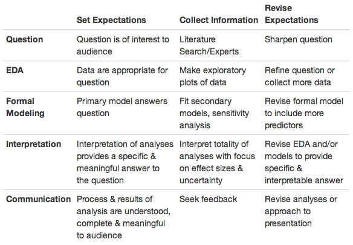

---
output:
  html_document:
    keep_md: yes
  pdf_document: default
---
# Epicycles of Analysis

To the uninitiated, a data analysis may appear to follow a linear, one-step-after-the-other process which at the end, arrives at a nicely packaged and coherent result.  In reality, data analysis is a highly iterative and non-linear process, better reflected by a series of epicycles (see Figure), in which information is learned at each step, which then informs whether (and how) to refine, and redo, the step that was just performed, or whether (and how) to proceed to the next step. 

An epicycle is a small circle whose center moves around the circumference of a larger circle. In data analysis, the iterative process that is applied to all steps of the data analysis can be conceived of as an epicycle that is repeated for each step along the circumference of the entire data analysis process.  Some data analyses appear to be fixed and linear, such as algorithms embedded into various software platforms, including apps.  However, these algorithms are final data analysis products that have emerged from the very non-linear work of developing and refining a data analysis so that it can be "algorithmized."

## Setting the Scene

Before diving into the "epicycle of analysis," it's helpful to pause and consider what we mean by a "data analysis." Although many of the concepts we will discuss in this book are applicable to conducting a *study*, the framework and concepts in this, and subsequent, chapters are tailored specifically to conducting a *data analysis*.  While a study includes developing and executing a plan for collecting data, a data analysis presumes the data have already been collected. More specifically, a study includes the development of a hypothesis or question, the designing of the data collection process (or study protocol), the collection of the data, and the analysis and interpretation of the data.  Because a data analysis presumes that the data have already been collected, it includes development and refinement of a question and the process of analyzing and interpreting the data.  It is important to note that although a data analysis is often performed without conducting a study, it may also be performed as a component of a study. 

## Epicycle of Analysis

There are 5 core activities of data analysis: 

1. Stating and refining the question

2. Exploring the data

3. Building formal statistical models

4. Interpreting the results

5. Communicating the results  

These 5 activities can occur at different time scales: for example, you might go through all 5 in the course of a day, but also deal with each, for a large project, over the course of many months.  Before discussing these core activities, which will occur in later chapters, it will be important to first understand the overall framework used to approach each of these activities.

Although there are many different types of activities that you might engage in while doing data analysis, every aspect of the entire process can be approached through an iterative process that we call the "epicycle of data analysis". More specifically, for each of the five core activities, it is critical that you engage in the following steps:

1. Setting Expectations, 

2. Collecting information (data), comparing the data to your expectations, and if the expectations don’t match, 
 
3. Revising your expectations or fixing the data so your data and your expectations match. 

Iterating through this 3-step process is what we call the “epicycle of data analysis.” As you go through every stage of an analysis, you will need to go through the epicycle to continuously refine your question, your exploratory data analysis, your formal models, your interpretation, and your communication. 

The repeated cycling through each of these five core activities that is done to complete a data analysis forms the larger circle of data analysis (See Figure).  In this chapter we go into detail about what this 3-step epicyclic process is and give examples of how you can apply it to your data analysis.

## Setting Expectations

Developing expectations is the process of deliberately thinking about what you expect before you do anything, such as inspect your data, perform a procedure, or enter a command.  For experienced data analysts, in some circumstances, developing expectations may be an automatic, almost subconscious process, but it’s an important activity to cultivate and be deliberate about.  

For example, you may be going out to dinner with friends at a cash-only establishment and need to stop by the ATM to withdraw money before meeting up.  To make a decision about the amount of money you’re going to withdraw, you have to have developed some expectation of the cost of dinner.   This may be an automatic expectation because you dine at this establishment regularly so you know what the typical cost of a meal is there, which would be an example of *a priori* knowledge.  Another example of *a priori* knowledge would be knowing what a typical meal costs at a restaurant in your city, or knowing what a meal at the most expensive restaurants in your city costs. Using that information, you could perhaps place an upper and lower bound on how much the meal will cost.

You may have also sought out external information to develop your expectations, which could include asking your friends who will be joining you or who have eaten at the restaurant before and/or Googling the restaurant to find general cost information online or a menu with prices.   This same process, in which you use any a priori information you have and/or external sources to determine what you expect when you inspect your data or execute an analysis procedure, applies to each core activity of the data analysis process.

## Collecting Information  

This step entails collecting information about your question or your data.  For your question, you collect information by performing a literature search or asking experts in order to ensure that your question is a good one. In the next chapter, we will discuss characteristics of a good question.  For your data, after you have some expectations about what the result will be when you inspect your data or perform the analysis procedure, you then perform the operation. The results of that operation are the data you need to collect, and then you determine if the data you collected matches your expectations.  To extend the restaurant metaphor, when you go to the restaurant, getting the check is collecting the data.   

## Comparing Expectations to Data

Now that you have data in hand (the check at the restaurant), the next step is to compare your expectations to the data.  There are two possible outcomes:  either your expectations of the cost match the amount on the check, or they do not.  If your expectations and the data match, terrific, you can move onto the next activity.  If, on the other hand, your expectations were a cost of 30 dollars, but the check was 40 dollars, your expectations and the data do not match.  There are two possible explanations for the discordance: first, your expectations were wrong and need to be revised, or second, the check was wrong and contains an error.  You review the check and find that you were charged for two desserts instead of the one that you had, and conclude that there is an error in the data, so ask for the check to be corrected.

One key indicator of how well your data analysis is going is how easy or difficult it is to match the data you collected to your original expectations. You want to setup your expectations and your data so that matching the two up is easy. In the restaurant example, your expectation was $30 and the data said the meal cost $40, so it’s easy to see that (a) your expectation was off by $10 and that (b) the meal was more expensive than you thought. When you come back to this place, you might bring an extra $10. If our original expectation was that the meal would be between $0 and $1,000, then it’s true that our data fall into that range, but it’s not clear how much more we’ve learned. For example, would you change your behavior the next time you came back? The expectation of a $30 meal is sometimes referred to as a sharp hypothesis because it states something very specific that can be verified with the data.

## Applying the Epicycle of Analysis Process

Before we discuss a couple of examples, let’s review the three steps to use for each core data analysis activity.  These are :

1. Setting expectations, 

2. Collecting information (data), comparing the data to your expectations, and if the expectations don’t match,

3. Revising your expectations or fixing the data so that your expectations and the data match. 

### Example: Asthma prevalence in the U.S.

Let's apply the "data analysis epicycle" to a very basic example. Let's say your initial question is to determine the prevalence of asthma among adults, because your company wants to understand how big the market might be for a new asthma drug.  You have a general question that has been identified by your boss, but need to: (1) sharpen the question, (2) explore the data, (3) build a statistical model, (4) interpret the results, and (5) communicate the results.  We'll apply the "epicycle" to each of these five core activities.

For the first activity, refining the question, you would first develop your expectations of the question, then collect information about the question and determine if the information you collect matches your expectations, and if not, you would revise the question.   Your expectations are that the answer to this question is unknown and that the question is answerable.  A literature and internet search, however, reveal that this question has been answered (and is continually answered by the Centers for Disease Control (CDC)), so you reconsider the question since you can simply go to the CDC website to get recent asthma prevalence data.  

You inform your boss and initiate a conversation that reveals that any new drug that was developed would target those whose asthma was not controlled with currently available medication, so you identify a better question, which is “how many people in the United States have asthma that is not currently controlled, and what are the demographic predictors of uncontrolled asthma?”   You repeat the process of collecting information to determine if your question is answerable and is a good one, and continue this process until you are satisfied that you have refined your question so that you have a good question that can be answered with available data.

Let's assume that you have identified a data source that can be downloaded from a website and is a sample that represents the United States adult population, 18 years and older. The next activity is exploratory data analysis, and you start with the expectation that when you inspect your data that there will be 10,123 rows (or records), each representing an individual in the US as this is the information provided in the documentation, or codebook, that comes with the dataset.  The codebook also tells you that there will be a variable indicating the age of each individual in the dataset. 

When you inspect the data, though, you notice that there are only 4,803 rows, so return to the codebook to confirm that your expectations are correct about the number of rows, and when you confirm that your expectations are correct, you return to the website where you downloaded the files and discover that there were two files that contained the data you needed, with one file containing 4,803 records and the second file containing the remaining 5,320 records.  You download the second file and read it into your statistical software package and append the second file to the first.  

Now you have the correct number of rows, so you move on to determine if your expectations about the age of the population matches your expectations, which is that everyone is 18 years or older.  You summarize the age variable, so you can view the minimum and maximum values and find that all individuals are 18 years or older, which matches your expectations.  Although there is more that you would do to inspect and explore your data, these two tasks are examples of the approach to take.  Ultimately, you will use this data set to estimate the prevalence of uncontrolled asthma among adults in the US.

The third activity is building a statistical model, which is needed in order to determine the demographic characteristics that best predict that someone has uncontrolled asthma. Statistical models serve to produce a precise formulation of your question so that you can see exactly how you want to use your data, whether it is to estimate a specific parameter or to make a prediction. Statistical models also provide a formal framework in which you can challenge your findings and test your assumptions.

Now that you have estimated the prevalence of uncontrolled asthma among US adults and determined that age, gender, race, body mass index, smoking status, and income are the best predictors of uncontrolled asthma available, you move to the fourth core activity, which is interpreting the results.   In reality, interpreting results happens along with model building as well as after you've finished building your model, but conceptually they are distinct activities.  

Let's assume you've built your final model and so you are moving on to interpreting the findings of your model. When you examine your final predictive model, initially your expectations are matched as age, African American/black race, body mass index, smoking status, and low income are all positively associated with uncontrolled asthma.  

However, you notice that female gender is *inversely* associated with uncontrolled asthma, when your research and discussions with experts indicate that among adults, female gender should be positively associated with uncontrolled asthma.  This mismatch between expectations and results leads you to pause and do some exploring to determine if your results are indeed correct and you need to adjust your expectations or if there is a problem with your results rather than your expectations.  After some digging, you discover that you had thought that the gender variable was coded 1 for female and 0 for male, but instead the codebook indicates that the gender variable was coded 1 for male and 0 for female. So the interpretation of your results was incorrect, not your expectations.  Now that you understand what the coding is for the gender variable, your interpretation of the model results matches your expectations, so you can move on to communicating your findings.

Lastly, you communicate your findings, and yes, the epicycle applies to communication as well.  For the purposes of this example, let's assume you've put together an informal report that includes a brief summary of your findings. Your expectation is that your report will communicate the information your boss is interested in knowing. You meet with your boss to review the findings and she asks two questions: (1) how recently the data in the dataset were collected and (2) how changing demographic patterns projected to occur in the next 5-10 years would be expected to affect the prevalence of uncontrolled asthma. Although it may be disappointing that your report does not fully meet your boss's needs, getting feedback is a critical part of doing a data analysis, and in fact, we would argue that a good data analysis requires communication, feedback, and then actions in response to the feedback.  

Although you know the answer about the years when the data were collected, you realize you did not include this information in your report, so you revise the report to include it.  You also realize that your boss's question about the effect of changing demographics on the prevalence of uncontrolled asthma is a good one since your company wants to predict the size of the market in the future, so you now have a new data analysis to tackle.  You should also feel good that your data analysis brought additional questions to the forefront, as this is one characteristic of a successful data analysis.

In the next chapters, we will make extensive use of this framework to discuss how each activity in the data analysis process needs to be continuously iterated. While executing the three steps may seem tedious at first, eventually, you will get the hang of it and the cycling of the process will occur naturally and subconsciously. Indeed, we would argue that most of the best data analysts don't even realize they are doing this! 

