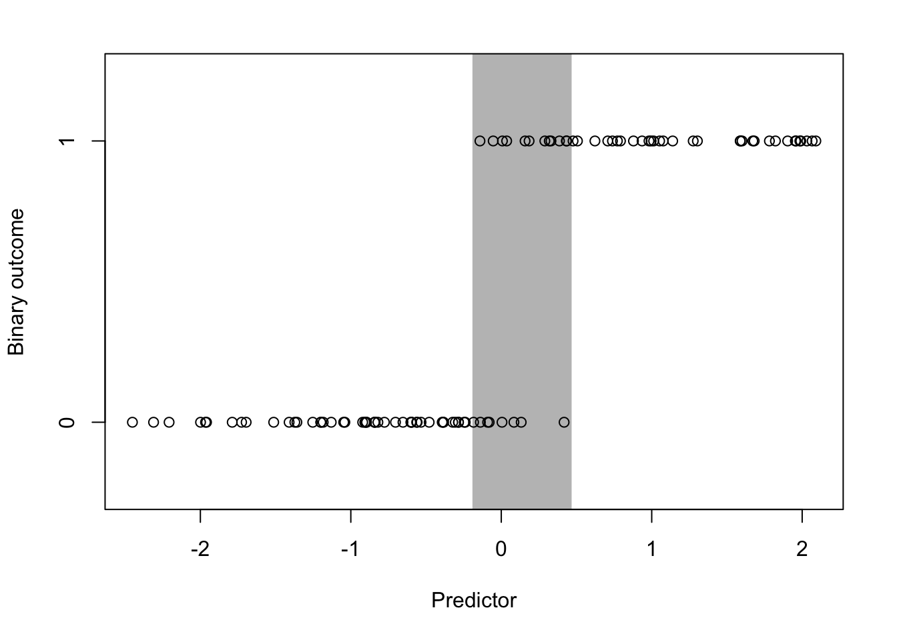

# Formal Modeling {#chapter-formal}


This chapter is typically the part of the statistics textbook or course where people tend to hit a wall. In particular, there's often a lot of math. Math is good, but gratuitous math is not good. We are not in favor of that.

It's important to realize that often it is useful to represent a model using mathematical notation because it is a compact notation and can be easy to interpret once you get used to it. Also, writing down a statistical model using mathematical notation, as opposed to just natural language, forces you to be precise in your description of the model and in your statement of what you are trying to accomplish, such as estimating a parameter. 

## What Are the Goals of Formal Modeling?

One key goal of formal modeling is to develop a precise specification of your question and how your data can be used to answer that question. Formal models allow you to identify clearly what you are trying to infer from data and what form the relationships between features of the population take. It can be difficult to achieve this kind of precision using words alone.

Parameters play an important role in many formal statistical models (in statistical language, these are known as *parametric statistical models*). These are numbers that we use to represent features or associations that exist in the population. Because they represent population features, parameters are generally considered unknown, and our goal is to estimate them from the data we collect. 

For example, suppose we want to assess the relationship between the number of ounces of soda consumed by a person per day and that person's BMI. The slope of a line that you might plot visualizing this relationship is the parameter you want to estimate to answer your question: "How much would BMI be expected to increase per each additional ounce of soda consumed?" More specifically, you are using a *linear regression model* to formulate this problem.

Another goal of formal modeling is to develop a rigorous framework with which you can challenge and test your primary results. At this point in your data analysis, you've stated and refined your question, you've explored the data visually and maybe conducted some exploratory modeling. The key thing is that you likely have a pretty good sense of what the answer to your question is, but maybe have some doubts about whether your findings will hold up under intense scrutiny. Assuming you are still interested in moving forward with your results, this is where formal modeling can play an important role.


## General Framework

We can apply the basic epicycle of analysis to the formal modeling portion of data analysis. We still want to set expectations, collect information, and refine our expectations based on the data. In this setting, these three phases look as follows.

1. **Setting expectations**. Setting expectations comes in the form of developing a *primary model* that represents your best sense of what provides the answer to your question. This model is chosen based on whatever information you have currently available.

2. **Collecting Information**. Once the primary model is set, we will want to create a set of secondary models that challenge the primary model in some way. We will discuss examples of what this means below.

3. **Revising expectations**. If our secondary models are successful in challenging our primary model and put the primary model's conclusions in some doubt, then we may need to adjust or modify the primary model to better reflect what we have learned from the secondary models.

### Primary model

It's often useful to start with a *primary model*. This model will likely be derived from any exploratory analyses that you have already conducted and will serve as the lead candidate for something that succinctly summarizes your results and matches your expectations. It's important to realize that at any given moment in a data analysis, the primary model is *not necessarily the final model*. It is simply the model against which you will compare other secondary models. The process of comparing your model to other secondary models is often referred to as *sensitivity analyses*, because you are interested in seeing how sensitive your model is to changes, such as adding or deleting predictors or removing outliers in the data. 

Through the iterative process of formal modeling, you may decide that a different model is better suited as the primary model. This is okay, and is all part of the process of setting expectations, collecting information, and refining expectations based on the data. 


### Secondary models

Once you have decided on a primary model, you will then typically develop a series of secondary models. The purpose of these models is to test the legitimacy and robustness of your primary model and potentially generate evidence against your primary model. If the secondary models are successful in generating evidence that refutes the conclusions of your primary model, then you may need to revisit the primary model and whether its conclusions are still reasonable.


## Associational Analyses

Associational analyses are ones where we are looking at an association between two or more features in the presence of other potentially confounding factors. There are three classes of variables that are important to think about in an associational analysis.

1. **Outcome**. The outcome is the feature of your dataset that is thought to change along with your **key predictor**. Even if you are not asking a causal or mechanistic question, so you don't necessarily believe that the outcome *responds* to changes in the key predictor, an outcome still needs to be defined for most formal modeling approaches.

2. **Key predictor**. Often for associational analyses there is one key predictor of interest (there may be a few of them). We want to know how the outcome changes with this key predictor. However, our understanding of that relationship may be challenged by the presence of potential confounders.

3. **Potential confounders**. This is a large class of predictors that are both related to the key predictor and the outcome. It's important to have a good understanding what these are and whether they are available in your dataset. If a key confounder is not available in the dataset, sometimes there will be a proxy that is related to that key confounder that can be substituted instead.

Once you have identified these three classes of variables in your dataset, you can start to think about formal modeling in an associational setting.

The basic form of a model in an associational analysis will be

{$$}
y = \alpha + \beta x + \gamma z + \varepsilon
{/$$}

where 

* {$$}y{/$$} is the outcome
* {$$}x{/$$} is the key predictor
* {$$}z{/$$} is a potential confounder
* {$$}\varepsilon{/$$} is independent random error
* {$$}\alpha{/$$} is the intercept, i.e. the value {$$}y{/$$} when {$$}x=0{/$$} and {$$}z=0{/$$}
* {$$}\beta{/$$} is the change in {$$}y{/$$} associated with a 1-unit increase {$$}x{/$$}, adjusting for {$$}z{/$$}
* {$$}\gamma{/$$} is the change in {$$}y{/$$} associated with a 1-unit increase in {$$}z{/$$}, adjusting for {$$}x{/$$}

This is a linear model, and our primary interest is in estimating the coefficient {$$}\beta{/$$}, which quantifies the relationship between the key predictor {$$}x{/$$} and the outcome {$$}y{/$$}. 

Even though we will have to estimate {$$}\alpha{/$$} and {$$}\gamma{/$$} as part of the process of estimating {$$}\beta{/$$}, we do not really care about the values of those {$$}\alpha{/$$} and {$$}\gamma{/$$}. In the statistical literature, coefficients like {$$}\alpha{/$$} and {$$}\gamma{/$$} are sometimes referred to as *nuisance parameters* because we have to use the data to estimate them to complete the model specification, but we do not actually care about their value.

The model shown above could be thought of as the primary model. There is a key predictor and one confounder in the model where it is perhaps well known that you should adjust for that confounder. This model may produce sensible results and follows what is generally known in the area. 


### Example: Online advertising campaign

Suppose we are selling a new product on the web and we are interested in whether buying advertisements on Facebook helps to increase the sales of that product. To start, we might initiate a 1-week pilot advertising campaign on Facebook and gauge the success of that campaign. If it were successful, we might continue to buy ads for the product. 

One simple approach might be to track daily sales before, during, and after the advertising campaign (note that there are more precise ways to do this with tracking URLs and Google Analytics, but let's leave that aside for now). Put simply, if the campaign were a week long, we could look at the week before, the week during, and the week after to see if there were any shifts in the daily sales. 

#### Expectations

In an ideal world, the data might look something like this.


The tick marks on the x-axis indicate the period when the campaign was active. In this case, it's pretty obvious what effect the advertising campaign had on sales. Using just your eyes, it's possible to tell that the ad campaign added about $100 per day to total daily sales. Your primary model might look something like

{$$}
y = \alpha + \beta x + \varepsilon
{/$$}


where {$$}y{/$$} is total daily sales and {$$}x{/$$} is and indicator of whether a given day fell during the ad campaign or not. The hypothetical data for the plot above might look as follows.


```
      sales campaign day
1  193.7355        0   1
2  201.8364        0   2
3  191.6437        0   3
4  215.9528        0   4
5  203.2951        0   5
6  191.7953        0   6
7  204.8743        0   7
8  307.3832        1   8
9  305.7578        1   9
10 296.9461        1  10
11 315.1178        1  11
12 303.8984        1  12
13 293.7876        1  13
14 277.8530        1  14
15 211.2493        0  15
16 199.5507        0  16
17 199.8381        0  17
18 209.4384        0  18
19 208.2122        0  19
20 205.9390        0  20
21 209.1898        0  21
```

Given this data and the primary model above, we'd estimate {$$}\beta{/$$} to be $96.78, which is not far off from our original guess of $100.

**Setting Expectations**. The discussion of this ideal scenario is important not because it's at all likely to occur, but rather because it instructs on what we would *expect* to see if the world operated according to a simpler framework and how we would analyze the data under those expectations.

#### More realistic data

Unfortunately, we rarely see data like the plot above. In reality, the effect sizes tend to be smaller, the noise tends to be higher, and there tend to be other factors at play. Typically, the data will look something like this.


While it does appear that there is an increase in sales during the period of the ad campaign (indicated by the tick marks again), it's a bit difficult to argue that the increased sales are *caused* by the campaign. Indeed, in the days before the campaign starts, there appears to be a slight increase in sales. Is that by chance or are there other trends going on in the background? 
It's possible that there is a smooth background trend so that daily sales tend to go up and down throughout the month. Hence, even without the ad campaign in place, it's possible we would have seen an increase in sales anyway. The question now is whether the ad campaign increased daily sales *on top of* this existing background trend.


Let's take our primary model, which just includes the outcome and the indicator of our ad campaign as a key predictor. Using that model we estimate {$$}\beta{/$$}, the increase in daily sales due to the ad campaign, to be $44.75.


However, suppose we incorporated a background trend into our model, so instead of our primary model, we fit the following.

{$$}
y = \alpha + \beta x + \gamma_1 t + \gamma_2 t^2 + \varepsilon
{/$$}

where {$$}t{/$$} now indicates the day number (i.e. {$$}1,2,\dots,21{/$$}). What we have done is add a quadratic function of {$$}t{/$$} to the model to allow for some curvature in the trend (as opposed to a linear function that would only allow for a strictly increasing or decreasing pattern). Using this model we estimate {$$}\beta{/$$} to be $39.86, which is somewhat less than what the primary model estimated for {$$}\beta{/$$}.


We can fit one final model, which allows for an even more flexible background trend--we use a 4th order polynomial to represent that trend. Although we might find our quadratic model to be sufficiently complex, the purpose of this last model is to just push the envelope a little bit to see how things change in more extreme circumstances. This model gives us an estimate of {$$}\beta{/$$} of $49.1, which is in fact larger than the estimate from our primary model.


At this point we have a primary model and two secondary models, which give somewhat different estimates of the association between our ad campaign and daily total sales. 

| Model | Features | Estimate for {$$}\beta{/$$} |
| ------| ---- | --------------------:|
| Model 1 (primary) | No confounders | $44.75 |
| Model 2 (secondary) | Quadratic time trend | $39.86 |
| Model 3 (secondary) | 4th order time trend | $49.1 |

#### Evaluation

Determining where to go from here may depend on factors outside of the dataset. Some typical considerations are

1. **Effect size**. The three models present a range of estimates from $39.86 to $49.1. Is this a large range? It's possible that for your organization a range of this magnitude is not large enough to really make a difference and so all of the models might be considered equivalent. Or you might consider these 3 estimates to be significantly different from each other, in which case you might put more weight on one model over another. Another factor might be the cost of the advertising campaign, in which case you would be interested in the return on your investment in the ads. An increase in $39.86 per day might be worth it if the total ad cost were $10 per day, but maybe not if the cost were $20 per day. Then, you might need the increase in sales to be higher to make the campaign worthwhile. The point here is that there's some evidence from your formal model that the ad campaign might only increase your total daily sales by 39.86, however, other evidence says it might be higher. The question is whether you think it is worth the risk to buy more ads, given the range of possibilities, or whether you think that even at the higher end, it's probably not worth it.

2. **Plausibility**. Although you may fit a series of models for the purposes of challenging your primary model, it may be the case that some models are more plausible than others, in terms of being close to whatever the "truth" about the population is. Here, the model with a quadratic trend seems plausible because it is capable of capturing a possible rise-and-fall pattern in the data, if one were present. The model with the 4th order polynomial is similarly capable of capturing this pattern, but seems overly complex for characterizing a simple pattern like that. Whether a model could be considered more or less plausible will depend on your knowledge of the subject matter and your ability to map real-world events to the mathematical formulation of the model. You may need to consult with other experts in this area to assess the plausibility of various models. 

3. **Parsimony**. In the case where the different models all tell the same story (i.e. the estimates are {$$}\beta{/$$} are close enough together to be considered "the same"), it's often preferable to choose the model that is simplest. There are two reasons for this. First, with a simpler model it can be easier to tell a story about what is going on in the data via the various parameters in the model. For example, it's easier to explain a linear trend than it is to explain an exponential trend. Second, simpler models, from a statistical perspective, are more "efficient", so that they make better use of the data per parameter that is being estimated. Complexity in a statistical model generally refers to the number of parameters in the model--in this example the primary model has 2 parameters, whereas the most complex model has 6 parameters. If no model produces better results than another, we might prefer a model that only contains 2 parameters because it is simpler to describe and is more parsimonious. If the primary and secondary models produce significant differences, then might choose a parsimonious model over a more complex model, but not if the more complex model tells a more compelling story. 


## Prediction Analyses

In the previous section we described associational analyses, where the goal is to see if a key predictor {$$}x{/$$} and an outcome {$$}y{/$$} are associated. But sometimes the goal is to use all of the information available to you to predict {$$}y{/$$}.  Furthermore, it doesn't matter if the variables would be considered unrelated in a causal way to the outcome you want to predict because the objective is prediction, not developing an understanding about the relationships between features.

With prediction models, we have outcome variables--features about which we would like to make predictions--but we typically do not make a distinction between "key predictors" and other predictors. In most cases, any predictor that might be of use in predicting the outcome would be considered in an analysis and might, *a priori*, be given equal weight in terms of its importance in predicting the outcome. Prediction analyses will often leave it to the prediction algorithm to determine the importance of each predictor and to determine the functional form of the model.

For many prediction analyses it is not possible to literally write down the model that is being used to predict because it cannot be represented using standard mathematical notation. Many modern prediction routines are structured as algorithms or procedures that take inputs and transform them into outputs. The path that the inputs take to be transformed into outputs may be highly nonlinear and predictors may interact with other predictors on the way. Typically, there are no parameters of interest that we try to estimate--in fact many algorithmic procedures do not have any estimable parameters at all.

The key thing to remember with prediction analyses is that we usually do not care about the specific details of the model. In most cases, as long as the method "works", is reproducible, and produces good predictions with minimal error, then we have achieved our goals.

With prediction analyses, the precise type of analysis you do depends on the nature of the outcome (as it does with all analyses). Prediction problems typically come in the form of a **classification problem** where the outcome is binary. In some cases the outcome can take more than two levels, but the binary case is by far the most common. In this section, we will focus on the binary classification problem.

#### Expectations

What's the ideal scenario in a prediction problem? Generally, what we want is a predictor, or a set of predictors, to produce *good separation* in the outcome. Here's an example of a single predictor producing reasonable separation in a binary outcome.



The outcome takes values of 0 and 1, while the predictor is continuous and takes values between roughly -2 and 2. The gray zone indicated in the plot highlights the area where values of the predictor can take on values of 0 or 1. To the right of the gray area you'll notice that the value of the outcome is always 1 and to the left of the gray area the value of the outcome is always 0. In prediction problems, it's this gray area where we have the most uncertainty about the outcome, given the value of the predictor. 

The goal of most prediction problems to identify a set of predictors that minimizes the size of that gray area in the plot above. Counterintuitively, it is common to identify predictors (particularly categorical ones) that *perfectly separate* the outcome, so that the gray area is reduced to zero. However, such situations typically indicate a degenerate problem that is not of much interest or even a mistake in the data. For example, a continuous variable that has been dichotomized will be perfectly separated by its continuous counterpart. It is a common mistake to include the continuous version as a predictor in the model and the dichotomous version as the outcome. In real-world data, you may see near perfect separation when measuring features or characteristics that are known to be linked to each other mechanistically or through some deterministic process. For example, if the outcome were an indicator of a person's potential to get ovarian cancer, then the person's sex might be a very good predictor, but it's not likely to be one of great interest to us.

#### Real world data


For this example we will use data on the credit worthiness of individuals. The dataset is taken from the [UCI Machine Learning Repository](https://archive.ics.uci.edu/ml/datasets/Statlog+(German+Credit+Data)). The dataset classifies individuals into "Good" or "Bad" credit risks and includes a variety of predictors that may predict credit worthiness. There are a total of 1000 observations in the dataset and 62 features. For the purpose of this exposition, we omit the code for this example, but the code files can be obtained from the Book's web site.

The first thing we do for a prediction problem is to divide the data into a training dataset and a testing dataset. The training dataset is for developing and fitting the model and the testing dataset is for evaluating our fitted model and estimating its error rate. In this example we use a random 75% of the observations to serve as the training dataset. The remaining 25% will serve as the test dataset.

After fitting the model to the training dataset we can compute the predicted probabilities of being having "Good" credit from the test dataset. We plot those predicted probabilities on the x-axis along with each individuals true credit status on the y-axis below. (The y-axis coordinates have been randomly jittered to show some more detail.)


```
1 package is needed for this model and is not installed. (pls). Would you like to try to install it now?
```

```
Error in checkInstall(models$library): 
```

```
Error in match.arg(type): 'arg' should be one of "response", "terms"
```

```
Error in plot(pred[, 2], jitter(unclass(testing$Class) - 1, 0.1), ylim = c(-0.25, : object 'pred' not found
```

```
Error in axis(2, 0:1, c("Bad", "Good")): plot.new has not been called yet
```

Here we can see that there isn't quite the good separation that we saw in the ideal scenario. Across the range of predicted probabilities, there are individuals with both "Good" and "Bad" credit. This suggests that the prediction algorithm that we have employed perhaps is having difficulty finding a good combination of features that can separate people with good and bad credit risk. 

We can compute some summary statistics about the prediction algorithm below.


```
Warning: 'newdata' had 250 rows but variables found have 100 rows
```

```
Error in confusionMatrix.default(data = pred.class, testing$Class, positive = "Good"): the data cannot have more levels than the reference
```

We can see that the accuracy is about 70%, which is not great for most prediction algorithms. In particular, the algorithm's specificity is very poor, meaning that if you are a "Bad" credit risk, the probability that you will be classified as such is only about 2.6%. 

#### Evaluation

For prediction problems, deciding on the next step after initial model fitting can depend on a few factors.

1. **Prediction quality**. Is the model's accuracy good enough for your purposes? This depends on the ultimate goal and the risks associated with subsequent actions. For medical applications, where the outcome might be the presence of a disease, we may want to have a high sensitivity, so that if you genuinely have the disease, the algorithm will detect it. That way we can get you into treatment quickly. However, if the treatment is very painful, perhaps with many side effects, then we might actually prefer a high specificity, which would ensure that we don't mistakenly treat someone who *doesn't* have the disease. For financial applications, like the credit worthiness example used here, there may be asymmetric costs associated with mistaking good credit for bad versus mistaking bad credit for good.

2. **Model tuning**. A hallmark of prediction algorithms is their many tuning parameters. Sometimes these parameters can have large effects on prediction quality if they are changed and so it is important to be informed of the impact of tuning parameters for whatever algorithm you use. There is no prediction algorithm for which a single set of tuning parameters works well for all problems. Most likely, for the initial model fit, you will use "default" parameters, but these defaults may not be sufficient for your purposes. Fiddling with the tuning parameters may greatly change the quality of your predictions. It's very important that you document the values of these tuning parameters so that the analysis can be reproduced in the future. 

3. **Availability of Other Data**. Many prediction algorithms are quite good at exploring the structure of large and complex datasets and identifying a structure that can best predict your outcome. If you find that your model is not working well, even after some adjustment of tuning parameters, it is likely that you need additional data to improve your prediction. 


## Summary

Formal modeling is typically the most technical aspect of data analysis, and its purpose is to precisely lay out what is the goal of the analysis and to provide a rigorous framework for challenging your findings and for testing your assumptions. The approach that you take can vary depending primarily on whether your question is fundamentally about estimating an association or developing a good prediction. 


