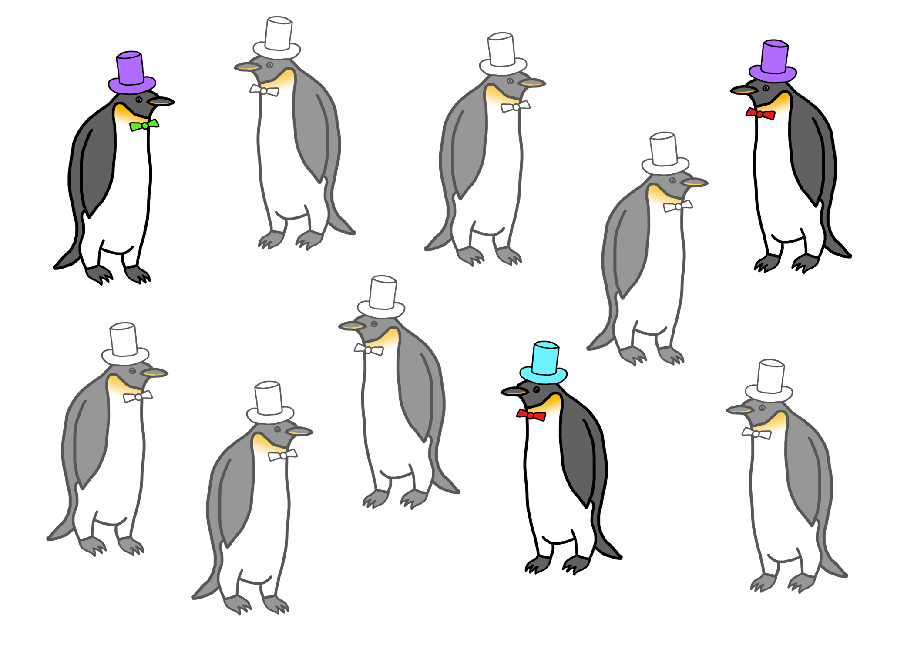

# Inference: A Primer {#chapter-inference}

Inference is one of many possible goals in data analysis and so it's worth discussing what exactly is the act of making inference. Recall previously we described one of the six types of questions you can ask in a data analysis is an **inferential** question. So what is inference?

In general, the goal of inference is to be able to make a statement about something that is *not observed*, and ideally to be able to characterize any uncertainty you have about that statement. Inference is difficult because of the difference between what you are able to observe and what you ultimately want to know. 

## Identify the population

The language of inference can change depending on the application, but most commonly, we refer to the things we cannot observe (but want to know about) as the **population** or as features of the population and the data that we observe as the **sample**. The goal is to use the sample to somehow make a statement about the population. In order to do this, we need to specify a few things.

Identifying the population is the most important task. If you cannot coherently identify or describe the population, then you cannot make an inference. Just stop. Once you've figured out what the population is and what feature of the population you want to make a statement about (e.g. the mean), then you can later translate that into a more specific statement using a formal statistical model (covered later in this book).

## Describe the sampling process

How did the data make its way from the population to your computer? Being able to describe this process is important for determining whether the data are useful for making inferences about features of the population. As an extreme example, if you are interested in the average age of women in a population, but your sampling process somehow is designed so that it only produces data on men, then you cannot use the data to make an inference about the average age of women. Understanding the sampling process is key to determining whether your sample is *representative* of the population of interest. Note that if you have difficulty describing the population, you will have difficulty describing the process of sampling data from the population. So describing the sampling process hinges on your ability to coherently describe the population.

## Describe a model for the population

We need to have an abstract representation of how elements of the population are related to each other. Usually, this comes in the form of a statistical model that we can represent using mathematical notation. However, in more complex situations, we may resort to algorithmic representations that cannot be written down neatly on paper (many machine learning approaches have to be described this way). The simplest model might be a *simple linear model*, such as

{$$}
y = \beta_0 +\beta_1 x + \varepsilon
{/$$}

Here, {$$}x{/$$} and {$$}y{/$$} are features of the population and {$$}\beta_0{/$$} and {$$}\beta_1{/$$} describe the relationship between those features (i.e. are they positively or negatively associated?). The final element {$$}\varepsilon{/$$} is a catch-all that is intended to capture all of the factors that contribute to the difference between the {$$}y{/$$} and what we *expect* {$$}y{/$$} to be, which is {$$}\beta_0 + \beta_1 x{/$$}. It is this last part that makes the model a statistical model because we typically allow {$$}\varepsilon{/$$} to be random.

Another characteristic that we typically need to make an assumption about is how different units in the population interact with each other. Typically, without any additional information, we will assume that the units in the population are *independent*, meaning that the measurements of one unit do not provide any information about the measurements on another unit. At best, this assumption is approximately true, but it can be a useful approximation. In some situations, such as when studying things that are closely connected in space or time, the assumption is clearly false, and we must resort to special modeling approaches to account for the lack of independence.

George Box, a statistician, [once said that](https://en.wikipedia.org/wiki/All_models_are_wrong) "all models are wrong, but some are useful". It's likely that whatever model you devise for describing the features of a population, it is technically wrong. But you shouldn't be fixated on developing a *correct* model; rather you should identify a model that is useful to you and tells a story about the data and about the underlying processes that you are trying to study. 

## A Quick Example

Consider this group of penguins below (because penguins are awesome), each wearing either a purple or turquoise hat. There are a total of 10 penguins in this group. We'll call them the *population*.

Now suppose you wanted to know how what proportion of the *population* of penguins wears turquoise hats. But there's a catch--you don't have the time, money, or ability to take care of 10 penguins. Who does? You can only afford to take care of three penguins, so you randomly sample three of these 10 penguins. 

The key point is that you never observe the full population of penguins. Now what you end up with is your *dataset*, which contains only three penguins.

At this point an easy question to ask is "What proportion of the penguins *in my dataset* are wearing turquoise hats?". From the picture above, it's clear that 1/3 of the penguins are wearing turquoise hats. We have *no uncertainty* about that proportion because the data are sitting right in front of us.

The hard question to ask is "Based on the data I have, what proportion of the penguins in the *original population* are wearing turquoise hats?" At this point, we just have our sample of three penguins and do not observe the full population. What can we do? We need to make an *inference* about the population using the data we have on hand. 

The three things that we need to do to make an inference are:

1. **Define the population**. Here, the population is the original 10 penguins from which we sampled our dataset of three penguins.

2. **Describe the sampling process**. We haven't explicitly mentioned this, but suppose for now that our "sampling process" consisted of taking the first three penguins that walked up to us.

3. **Describe a model for the population**. We will assume that the hats the penguins wear are *independent* of each other, so the fact that one penguin has a purple hat doesn't influence whether another penguin has a turquoise hat. Since we only want to estimate a simple proportion of penguins with turquoise hats, we don't need to make any more complex assumptions about how penguins relate to each other.

Given the three ingredients above, we might estimate the proportion of penguins with turquoise hats to be 1/3. How good of an estimate is this? Given that we know the truth here--2/5 of the penguins have turquoise hats in the population--we might ask whether 1/3 is a reasonable estimate or not. The answer to that question depends on a variety of factors that will be discussed in the next section.

## Factors Affecting the Quality of Inference

The key factors affecting the quality of an inference you might make relate to violations in our thinking about the sampling process and the model for the population. Obviously, if we cannot coherently define the population, then any "inference" that we make to the population will be similarly vaguely defined.

A violation of our understanding of how the sampling process worked would result in our having collected data that did not represent the population in the way that we thought it would. This would affect our inference in that the inference we would make would apply not to the entire population, but to a specific selection of the population. This phenomenon is sometimes referred to as **selection bias** because the quantities that you estimate are biased toward the selection of the population that you *did* sample. 

A violation of the model that we posit for the population could result in us estimating the wrong relationship between features of the population or underestimating the uncertainty of our estimates. For example, if it's true that penguins can influence what color hats other penguins wear, then that would violate the assumption of independence between penguins. This would result in an increase in the uncertainty of any estimates that we make from the data. In general, dependence between units in a population reduce the "effective sample size" of your dataset because the units you observe are not truly independent of each other and do not represent independent bits of information. 

A final reason for a difference between our estimate from data and the truth in the population is **sampling variability**. Because we randomly sampled penguins from the population, it's likely that if we were to conduct the experiment again and sample another three penguins, we would get a different estimate of the number of penguins with turquoise hats, simply due to random variation in the sampling process. This would occur even if our description of the sampling process were accurate and our model for the population were perfect. 

In most cases, differences between what we can estimate with data and what the truth is in the population can be explained by a combination of all three factors. How big a role each plays in a given problem can be difficult to determine sometimes due to a lack of information, but it is usually worth putting some thought into each one of these factors and deciding which might be playing a dominant role. That way, one may be able to correct the problem, for example, in future studies or experiments.

## Example: Apple Music Usage

On August 18, 2015, consumer market research firm MusicWatch [released a study](http://www.businesswire.com/news/home/20150818005755/en#.VddbR7Scy6F) about a new music service launched by Apple, Inc. called Apple Music. The service was a new streaming music service designed to give users streaming access to a large catalog of music for $9.99 per month. However, there was a free trial period that lasted for 3 months. At the time there was much speculation over how many users would ultimately continue to pay the $9.99 per month once the free trial ended.

MusicWatch's study claimed, among other things, that

> Among people who had tried Apple Music, 48 percent reported they are not currently using the service.

This would suggest that almost half of people who had signed up for the free trial period of Apple Music were not interested in using it further and would likely not pay for it once the trial ended. If it were true, it would be a blow to the newly launched service.

But how did MusicWatch arrive at its number? It claimed to have surveyed 5,000 people in its study. Shortly before the survey by MusicWatch was released, Apple claimed that about 11 million people had signed up for their new Apple Music service (because the service had just launched, everyone who had signed up was in the free trial period). Clearly, 5,000 people do not make up the entire population, so we have but a small sample of users.

What is the target that MusicWatch was trying to answer? It seems that they wanted to know the percentage of *all people who had signed up for Apple Music* that were still using the service. Because it would have been enormously expensive to survey all 11 million people, they had to resort to a much smaller sample of 5,000. Can they make inference about the entire population from the sample of 5,000?

Let's consider the three ingredients for inference:

1. **Population**: We are interested in the behavior of the entire Apple Music user base, which is approximately 11 million people, according to Apple.

2. **Sampling process**: It's not clear from the press release how the study was conducted and the data collected. It's likely this was a telephone survey and so people were randomly selected to be called and asked about their use of the service. Do you think this process led to a sample of respondents that is representative of the entire population of Apple Music users?

3. **Model for the population**: Given the relatively small size of the sample relative to the entire population, it's likely that the individuals in the survey could be thought of being independent of each other. In other words, it's unlikely that one respondent in the survey could have influenced another respondent. 

If the sample is representative and the individuals are independent, we could use the number 48% as an estimate of the percentage in the population who no longer use the service. The press release from MusicWatch did not indicate any measure of uncertainty, so we don't know how reliable the number is.

Interestingly, soon after the MusicWatch survey was released, Apple released a statement to the publication *The Verge*, stating that 79% of users who had signed up were still using the service (i.e. only 21% had stopped using it, as opposed to 48% reported by MusicWatch). Now, the difference between Apple and MusicWatch is that Apple has easy access to the entire population of Apple Music users. If they want to know what percentage of the *population* of users is still using it, they simply need to count the number of active users of the service and divide by the total number of people who signed up. There is *no uncertainty* about that particular number, because no sampling was needed to estimate it (I assume Apple did not use sampling to estimate the percentage).

If we believe that Apple and MusicWatch were measuring the same thing in their analyses (and it's not clear that they were), then it would suggest that MusicWatch's estimate of the population percentage (48%) was quite far off from the true value (21%). What would explain this large difference?

1. **Random variation**. It's true that MusicWatch's survey was a small sample relative to the full population, but the sample was still big with 5,000 people. Furthermore, the analysis was fairly simple (just taking the proportion of users still using the service), so the uncertainty associated with that estimate is unlikely to be that large.

2. **Selection bias**. Recall that it's not clear how MusicWatch sampled its respondents, but it's possible that the way that they did it led them to capture a set of respondents who were less inclined to use Apple Music. Beyond this, we can't really say more without knowing the details of the survey process.

3. **Measurement differences**. One thing we don't know is how either MusicWatch or Apple defined "still using the service". You could imagine a variety of ways to determine whether a person was still using the service. You could ask "Have you used it in the last week?" or perhaps "Did you use it yesterday?" Responses to these questions would be quite different and would likely lead to different overall percentages of usage.

4. **Respondents are not independent**. It's possible that the survey respondents are not independent of each other. This would primarily affect the uncertainty about the estimate, making it larger than we might expect if the respondents were all independent. However, since we do not know what MusicWatch's uncertainty about their estimate was in the first place, it's difficult to tell if dependence between respondents could play a role.

## Populations Come in Many Forms

There are a variety of strategies that one can employ to setup a formal framework for making inferential statements. Often, there is literally a population of units (e.g. people, penguins, etc.) about which you want to make statements. In those cases it's clear where the uncertainty comes from (sampling from the population) and what exactly it is you're trying to estimate (some feature of the population). However, in other applications it might not be so clear what exactly is the population and what exactly it is you're trying to estimate. In those cases, you'll have to be more explicit about defining the population because there may be more than one possibility.

### Time series 

Some processes are measured over time (every minute, every day, etc.). For example, we may be interested in analyzing data consisting of Apple's daily closing stock price for calendar year 2014. If we wanted to make an inference from this dataset, what would the population be? There are a few possibilities. 

1. We might argue that the year 2014 was randomly sampled from the population of *all possible years* of data, so that inferences that we make apply to other years of the stock price. 

2. We might say the Apple's stock represents a sample from the *entire stock market*, so that we can make inference about *other stocks* from this dataset. 

Regardless of what you choose, it's important to make clear what population you are referring to before you attempt to make inference from the data.

### Natural processes 

Natural phenomena, such as earthquakes, fires, hurricanes, weather-related phenomena, and other events that occur in nature, often are recorded over time and space. For purely temporal measurements, we might define the population in the same way that we defined the population above with the time series example. However, we may have data that is only measured in space. For example, we may have a map of the epicenters of all earthquakes that have occurred in an area. Then what is the population? One common approach is to say that there is an *unobserved stochastic process* that randomly drops earthquakes on to the area and that our data represent a random sample from this process. In that case, we are using the data to attempt to learn more about this unobserved process.

### Data as population

One technique that is always possible, but not commonly used, is to treat the dataset as a population. In this case, there is no inference because there's no sampling. Because your dataset *is* the population, there's no uncertainty about any characteristic of the population. This may not sound like a useful strategy but there are circumstances where it can be used to answer important questions. In particular, there are times where we do not care about things outside the dataset. 

For example, it is common in organizations to analyze salary data to make sure that women are not being paid less than men for comparable work or that there are not major imbalances between employees of different ethnic groups. In this setting, differences in salaries between different groups can be calculated in the dataset and one can see if the differences are large enough to be of concern. The point is that the data directly answer a question of interest, which is "Are there large salary differences that need to be addressed?" In this case there's no need to make an inference about employees outside the organization (there are none, by definition) or to employees at other organizations over which you would not have any control. The dataset is the population and answers to any question regarding the population are in that dataset.

