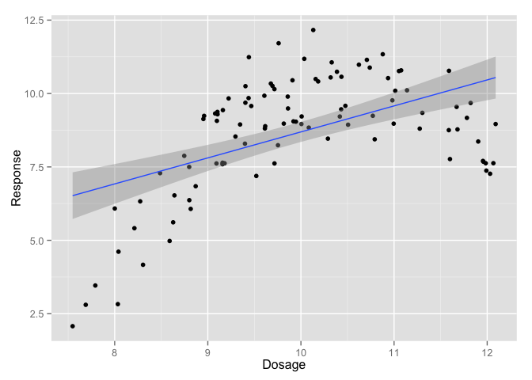
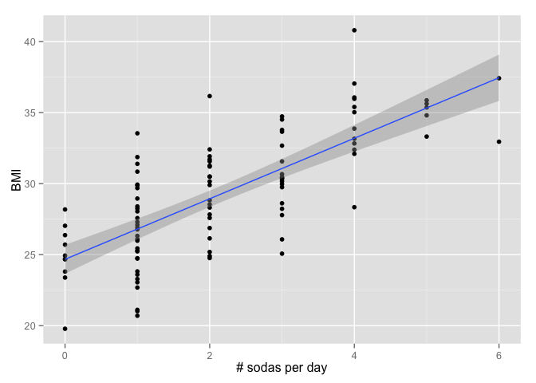
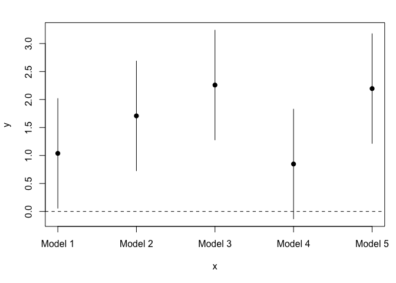
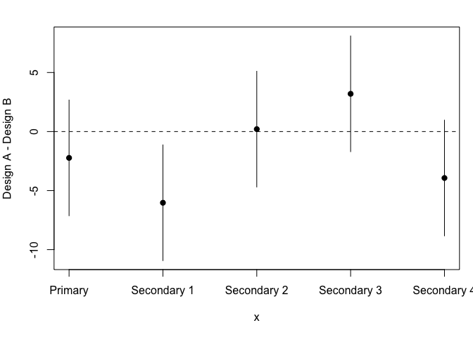

# Problems

## Question

A data analyst who works for you is looking at data from 100 individuals on exposure to a potentially harmful substance and the levels of a blood biomarker measured on each individual. In this case higher levels of the biomarker indicate greater harm from the substance. The analyst shows you the following scatterplot of the individual's biomarker vs. the dosage of the substance experienced by the individual.

 

## Question

You are conducting an associational analysis and attempting to estimate the association between soda consumption in the U.S. and body mass index (BMI). A scatterplot of the data from 100 individuals is shown below.

What is the directionality of the association depicted in this plot?

 

## Question

You are conducting an associational analysis and attempting to estimate the association between soda consumption in the U.S. and body mass index (BMI). As part of a sensitivity analysis you fit a series of 5 different models which of which produce a different estimate of the association, which is the change in BMI per 12 oz can of sode consumed daily. A plot of the estimates from the 5 models is shown below.

From the plot, which of the following properties is

 

## Question

You are building a web site and are A/B testing two different designs for the site. You want to know which designs lead to people taking a certain action on your web site (e.g. buying a product, clicking a button). The tests for the different designs are conducted separately over time because you do not want there to be two different versions of the web site available at any given time. Therefore, one issue may be the presence of time trends that can confound the relationship between a given design and the number of actions taken. The target of estimation is the average difference in actions taken on the web site per visit between design A and design B. 

In your formal modeling you fit a series of models to account for possible temporal trends in different ways. The results of your primary model and 4 secondary models is are shown below.

What could you conclude from these results?

 

